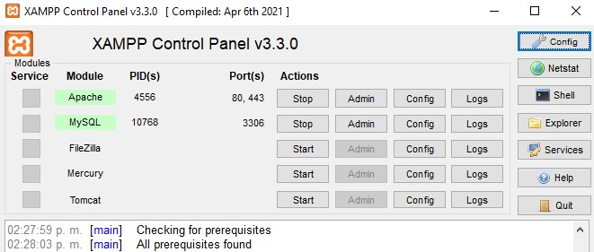
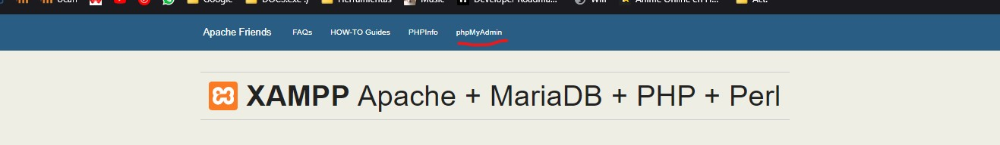
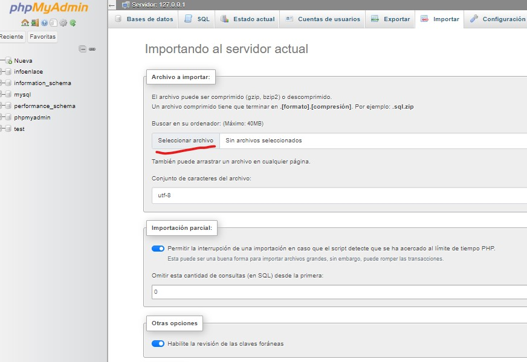

 

# Proyecto Pagina web -Infoenlace-

Descripción:
Proyecto que basicamente conciste en la creacion de una pagina web para la empresa la cual sea totalmente funcional con su base de datos.

# 🚨 Requisitos Previos 🚨
> [!IMPORTANT]
> 
Requeriras descargar lo siguiente:
> 
1. Instalacion de MysQl  
> https://dev.mysql.com/downloads/workbench/
> 
2. NodeJs  
> https://nodejs.org/en/download/package-manager
> 
3. Xampp  
> https://www.apachefriends.org/download.html
> 
4. Git  
> https://git-scm.com/downloads
> 
> 
> 
> 
>
>
>
>
> 

>[!CAUTION]
>
Es importante que al descargar lo necesario te fijes en el sistema operativo que tengas para descargar uno u otro archivo en los enlaces compartidos
>
>

# Para iniciar. -Clonar Repositorio-

 Crear una carpeta donde clonaras el repositorio que se muestra en la pagina web donde estas leyendo esto.  

>[!TIP]
> 
 Puedes iniciar git en la carpeta de entranda dando clic derecho y dando a "Open Git Bash here" 

Con la ventana de Git Bash abierta en la carpeta que utilizaras clonas en repositorio con el siguiente enlace.  
https://github.com/DEVOPSINFOENLACE/Devops2desk.git  

# Iniciando XAMPP -importar BD-
Cuando termines de clonar el repositorio tendras que iniciar XAMPP esto para poder entrar en PhpMyAdmin y importar la base de datos que te permitira usar el proyecto. 

Iniciamos los siguientes servicios:
- [X] Apache
- [X] MySQL
- [ ] FileZila
- [ ] Mercury
- [ ] Tomcat  
Una vez hecho esto damos clic en el boton de ADMIN del servicio de Apache 

Esto nos abrira nuestro navegador web predeterminado que tengamos y nos iremos al apartado de "PhpMyAdmin" 

Esto nos llevara a un menu DashBoard que nos permitira hacer varios procedimientos de nuestra base de datos de manera "Local"
  
Ahora seguiremos los siguientes pasos para importar la base de datos:  

1. Importamos entrando en el apartado de importar en la parte superior de nuestro menu  
2.Vamos a seleccionar archivo donde se muestra en la imagen superior.  
3.Esto nos abrira una ventana para seleccionar un archivo SQL, el cual lo encontraremos en la carpeta donde anteriormente clonaste el repositorio en la subcarpeta de "Basededatos"

# Utilizando VSC para iniciar el proyecto
Ahora con visual estudio code abrimos un proyecto con la carpeta clonada y una vez ahi podemos, usar una terminal y usar el siguiente comando.  
"node index"  
Si todo a salido correctamente la terminal deberia de regresarte que se a creado el servidor junto con su nodo de red el cual veras en la terminal para abrirlo mediante un clic o usando un navegador con localhost:(puerto que te dio)  
Con esto ya podras usar todas las ventanas para visualizar cambios que hagas o realices al proyecto.